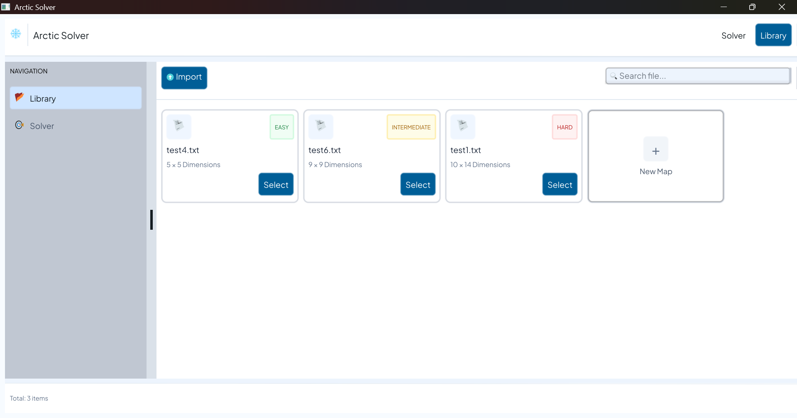
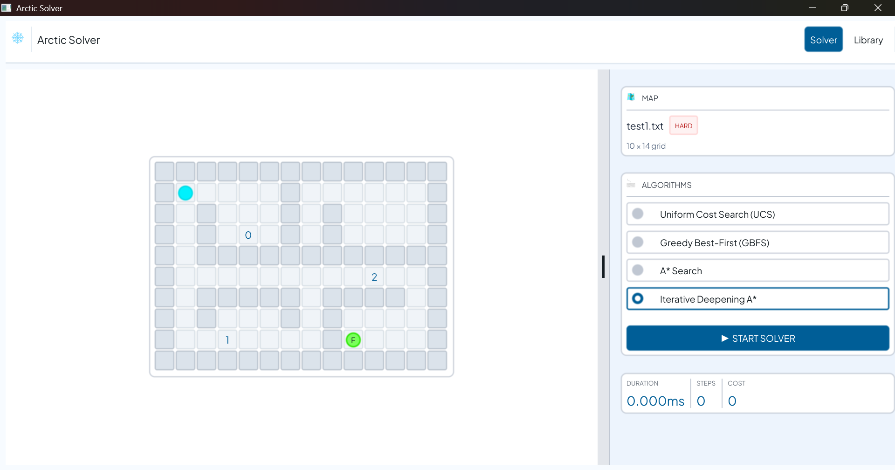
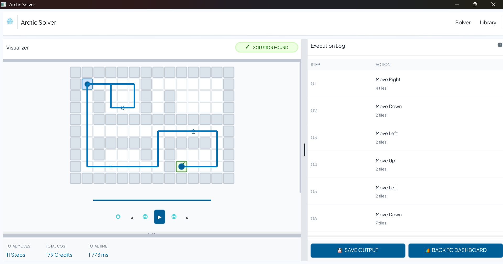

# Tucil3_13524041_13524104
**Ice Sliding Puzzle Solver** adalah program solver permainan logika *Ice Sliding Puzzle* berbasis GUI yang dibangun menggunakan bahasa Go dan framework Fyne. Dalam permainan ini, pemain mengendalikan sebuah karakter yang bergerak di atas permukaan es yang licin. Karakter tidak dapat berhenti di sembarang tempat, melainkan terus meluncur hingga menabrak dinding atau rintangan. Program ini secara otomatis mencari solusi optimal menggunakan berbagai algoritma pathfinding dan memvisualisasikan proses pencarian secara step-by-step.

## Algoritma yang Digunakan
- Uniform Cost Search (UCS)
- Greedy Best-First Search (GBFS)
- A* Search
- Iterative Deepening A* (IDA*)

## Fitur Utama
- Terdapat 3 page: `libraryPage`, `solverPage`, `resultPage`
- Import map puzzle dari file `.txt`
- Pilih algoritma yang ingin digunakan
- Animasi pathfinding + playback step-by-step (maju/mundur)
- Simpan hasil solusi ke file output `.txt`

## Requirement (Jika Menjalankan Langsung)

### Windows
- Go `1.23+`
- TDM-GCC (untuk kompilasi CGO yang dibutuhkan Fyne)
  - Download: https://jmeubank.github.io/tdm-gcc/
- Dependency utama: `fyne.io/fyne/v2`

### Linux
- Go `1.23+`
- GCC dan library display:
```bash
  sudo apt-get install gcc libgl1-mesa-dev xorg-dev
```
- Dependency utama: `fyne.io/fyne/v2`

## Struktur Proyek
```
├── src/
│   ├── filehandler/     
│   ├── gui/             
│   ├── algorithm/       
│   ├── puzzle/          
│   └── main.go      	 
├── bin/                 
├── test/                
└── doc/                
```

## Format File Input
Baris pertama memuat dua angka `N M` yang menyatakan ukuran papan.
`N` baris berikutnya merepresentasikan grid papan.
`N` baris berikutnya merepresentasikan cost traversal tiap tile.

Keterangan simbol grid:
| Simbol | Keterangan |
|--------|------------|
| `Z` | Posisi awal aktor |
| `O` | Titik tujuan |
| `X` | Rintangan/batu — aktor berhenti tepat sebelumnya |
| `L` | Lava — menyebabkan game over jika dilewati |
| `0`–`9` | Checkpoint berurutan yang wajib dilewati sesuai urutan |
| `*` | Tile kosong yang dapat dilewati bebas |

Contoh file input tersedia di folder `test/`

## Menjalankan Program

### Menjalankan Executable
#### Windows
Jalankan langsung executable yang tersedia di folder `bin/`:
```powershell
.\bin\ArcticSolver.exe
```

#### Linux
Beri izin execute terlebih dahulu, lalu jalankan:
```bash
chmod +x bin/ArcticSolver
./bin/ArcticSolver
```

### Menjalankan Langsung
```bash
go run src/main.go
```

## Cara Penggunaan
1. Buka halaman **Library**

2. Klik **Import** dan pilih file `.txt` dari folder `test/` atau memilih map yang telah di-*import*
3. Pilih algoritma dan klik **START SOLVER** untuk menjalankan pencarian

4. Lihat hasil solusi di halaman **Result**

5. Gunakan tombol playback untuk melihat langkah-langkah solusi secara step-by-step
6. Klik **SAVE OUTPUT** untuk menyimpan hasil ke file `.txt`

## Format Output
File output yang disimpan berisi:
- Urutan gerakan solusi (`U/D/L/R`)
- Total biaya (cost) solusi
- Visualisasi papan pada tiap langkah
- Waktu eksekusi (ms)
- Jumlah iterasi yang dilakukan

## Author
| Nama | NIM |
|------|-----|
| Nathan Adhika Santosa | 13524041 |
| Valentino Daniel Kusumo | 13524104 |